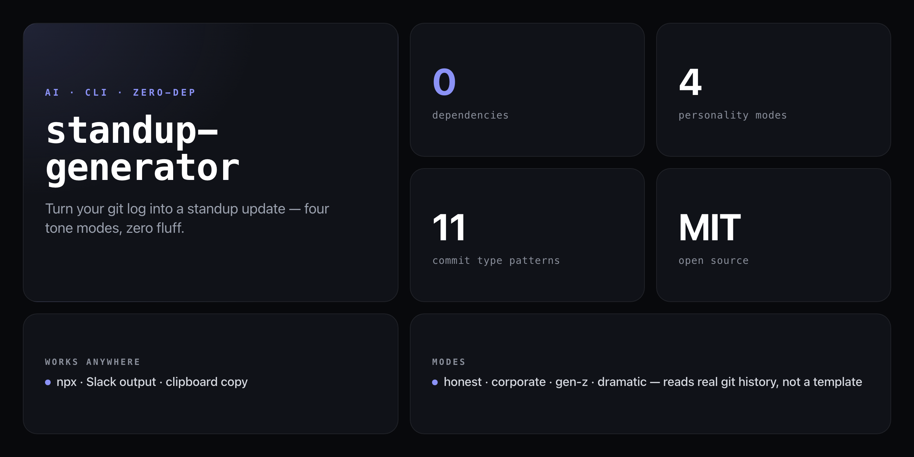

<div align="center">

**Reads your actual git history. Translates commits into standup-speak. Runs in seconds.**


</div>

---

Writing a standup update from scratch every morning is a waste of engineering time. `standup-generator` reads your `git log`, maps each commit to a human-sounding bullet in whichever tone you need, and prints a ready-to-use Yesterday / Today / Blockers block — with optional Slack formatting and clipboard copy.

```
╔══════════════════════════════════════╗
║   STANDUP UPDATE GENERATOR           ║
║   HONEST MODE                        ║
╚══════════════════════════════════════╝

Yesterday (last 24h, 3 commits):
  • mass-murdered the "null check" bug that's been haunting prod since Tuesday
  • moved code around and called it "architecture" (auth refactor)
  • did the dishes nobody else wanted to touch: bump deps

Today:
  • stare at a bug for 2 hours, fix it with one semicolon
  • leave a comment saying "// TODO: fix later" (it will never be fixed)
  • probably break what I fixed yesterday

Blockers:
  • the ticket has no acceptance criteria and I'm fully improvising
  • waiting for review from someone who's "OOO until Thursday"
```

## Install

No npm account needed — runs straight from GitHub:

```bash
npx github:NickCirv/standup-generator
```

## Usage

```bash
# Default: honest mode, last 24h
npx github:NickCirv/standup-generator

# Corporate mode, last 2 days
npx github:NickCirv/standup-generator --personality corporate --days 2

# Gen-Z, copy to clipboard
npx github:NickCirv/standup-generator --personality gen-z --copy

# Slack-formatted, ready to paste
npx github:NickCirv/standup-generator --personality honest --slack --copy

# Dramatic retrospective for the week
npx github:NickCirv/standup-generator --personality dramatic --days 7
```

| Flag | Description |
|------|-------------|
| `--personality <mode>` | `honest` \| `corporate` \| `gen-z` \| `dramatic` (default: `honest`) |
| `--days <n>` | How many days back to scan git history (default: `1`) |
| `--slack` | Plain-text Slack-formatted output (no ANSI colours) |
| `--copy` | Copy result to clipboard (macOS, Linux, Windows) |
| `--help` | Show help |

## Personality modes

### `--personality honest` (default)
Raw developer truth. Actual commit types mapped to real-sounding bullets.

### `--personality corporate`
Maximum jargon. For when the VP joins the standup.

### `--personality gen-z`
Vibes-first. Shockingly clear.

### `--personality dramatic`
Shakespeare joined your engineering team.

## Commit translation

The tool detects commit type from message keywords and conventional commit prefixes, then applies the personality translator:

| Commit type | Pattern matched |
|-------------|-----------------|
| `fix` | `fix`, `bug`, `hotfix`, `patch` or `fix:` prefix |
| `refactor` | `refactor`, `ref:` prefix |
| `test` | `test`, `spec`, `jest`, `vitest` |
| `feat` | `feat`, `feature`, `add`, `new`, `implement` |
| `docs` | `docs`, `readme`, `changelog` |
| `style` | `style`, `lint`, `format`, `prettier`, `eslint` |
| `chore` | `chore`, `deps`, `upgrade`, `update`, `bump` |
| `merge` | `merge` |
| `revert` | `revert` |
| `wip` | `WIP` |
| `initial` | `initial commit` |

Works with conventional commits (`fix: null check`, `feat(auth): add login`) and plain messages alike.

## What it is NOT

- **Not an AI summariser.** Output comes entirely from your real git log — no network calls, no LLM, no hallucinations.
- **Not a standup bot or integrations layer.** It generates text; sending it to Slack/Jira/email is up to you.
- **Not useful outside a git repo.** Must be run from inside a git-tracked project directory.

## Requirements

- Node.js 14+
- Run from inside a git repository
- Zero npm dependencies (pure Node.js stdlib)

---

<div align="center">
<sub>Zero dependencies · Node 14+ · MIT · by <a href="https://github.com/NickCirv">NickCirv</a></sub>
</div>
